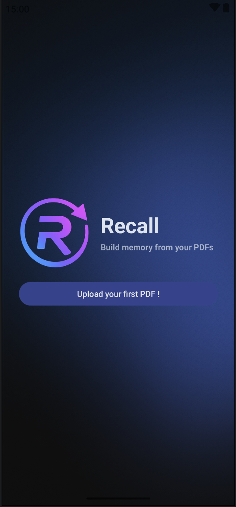
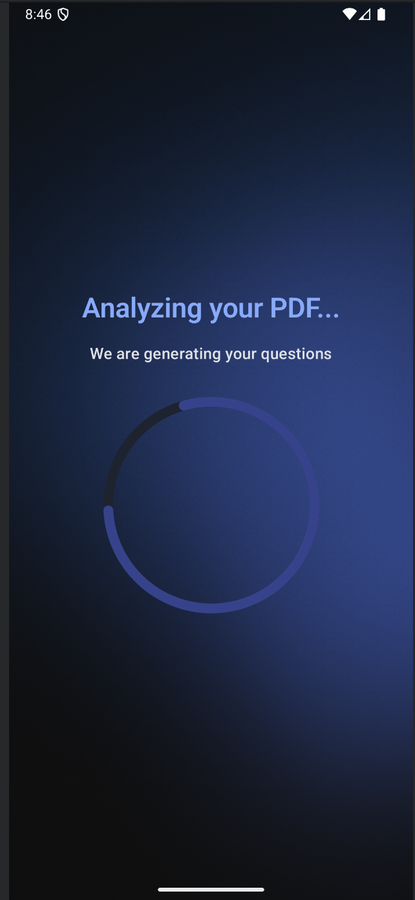
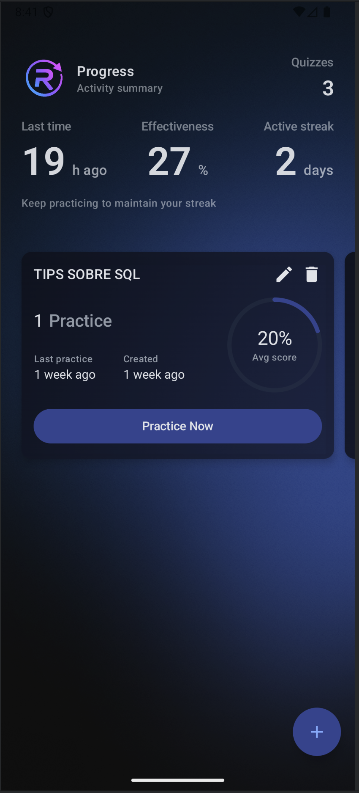
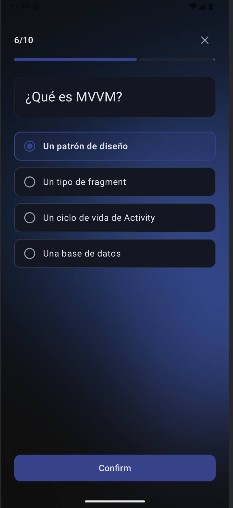

# Recall AI - Quiz Generator App

An Android app that creates and runs quizzes/flashcards from PDFs using Kotlin and Jetpack Compose.

## Overview

Recall is an educational app that transforms PDF documents into interactive quizzes and flashcards. It helps reinforce weaker knowledge by prioritizing topics you haven't practiced recently and questions you miss most often. This version uses the OpenAI API to generate real questions from PDFs while preserving the existing Room-based tracking of quiz stats.

## Main Features

- **PDF Source Library**: View all previously uploaded PDFs
- **Practice Statistics**: Each PDF shows:
  - Number of times practiced
  - Average score percentage
  - Last practice time (relative: "2 hours ago", "3 days ago")
- **Quick Actions**:
  - Tap any PDF card to repeat the quiz
  - Floating Action Button to upload new PDFs
- Real-time updates when quiz statistics change

- Clean, modern UI with Material 3 design
- PDF file picker integration 
- Automatic quiz generation from selected PDFs using OpenAI

## Screens

| Welcome                                       | Generation                                                |
|-----------------------------------------------|-----------------------------------------------------------|
| |  |
| Home                                          | Questions                                                 |
|  |    |

## Tech Stack

- **Language**: Kotlin
- **UI**: Jetpack Compose + Material 3
- **DI**: Hilt
- **Database**: Room
- **Navigation**: Jetpack Navigation Compose
- **Async**: Kotlin Coroutines + Flow
- **Architecture**: MVVM + Clean Architecture
## OpenAI PDF Question Generation

This app generates questions from PDFs using the OpenAI **Files** and **Responses** APIs with strict JSON schema output.
### 1) Pick a PDF (Storage Access Framework)
- The user selects a PDF via SAF, and the app receives a `content://...` URI.
- `GenerationRepositoryImpl` reads the PDF bytes via `Context.readBytesFromUri(uriString)`.

### 2) Upload the PDF to OpenAI Files API
- The data source `OpenAiQuestionGenerationRemoteDataSource` uploads the bytes to:
  - `POST https://api.openai.com/v1/files`
  - `purpose = "assistants"`
- The response returns a `fileId` (e.g., `file_...`).

### 3) Generate questions via OpenAI Responses API
- The app calls:
  - `POST https://api.openai.com/v1/responses`
- The request includes:
  - `model` (e.g., `gpt-4o-mini`)
  - `input` with:
    - A **system** message describing the JSON-only requirements
    - A **user** message referencing the uploaded `fileId`
  - `text.format` configured as `json_schema`
- The response returns a JSON string matching the schema.

